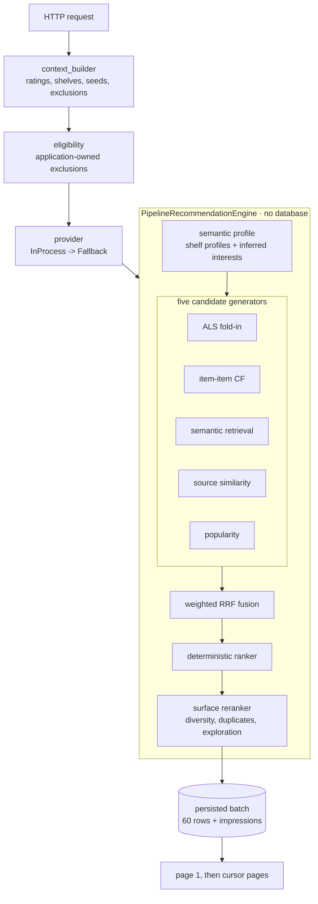

# The recommendation funnel

How a batch of recommendations is produced, what each artifact contributes,
which numbers are tunable and where the system's known limits are.

Authoritative specification: `RECOMMENDER_SPECIFICATION.md`, then the ADRs
(0013-0026). This document is the map, not the law — where it disagrees with
an ADR, the ADR wins.

---

## 1. The shape of a request



Two rules shape everything above:

- **No database during inference.** The engine holds artifacts loaded once at
  construction and reads an immutable request. The service commits its read
  transaction *before* calling the provider (`service.py`).
- **The order leaving the engine is authoritative.** It is persisted, and
  cursor pages replay it. Nothing downstream re-sorts (ADR-0006, ADR-0007).

## 2. Artifacts

Six families, all built offline, all resolved against `work_id` rather than
`book_id` so a catalog rebuild cannot silently re-point them (ADR-0020).

| family | what it holds | build time | notes |
|---|---|---|---|
| `popularity` | Bayesian-shrunk score per book | seconds | the fallback engine, and a ranker prior |
| `source_similarity` | resolved Goodreads edges | seconds | ranks, not weights |
| `item_metadata` | title, author, genre, cleaned tags | ~20 s | reasons, diversity, duplicate identity |
| `als` | item factors + fold-in solver | ~1 min | global model, never retrained per user |
| `item_cf` | top-K neighbours per item | ~2.5 min | support-filtered (ADR-0026) |
| `content` | Qwen3 embeddings, 512-dim | **~96 min** | use `--limit` in development |

```bash
make setup-training            # heavy deps live in a non-default uv group (ADR-0021)
make build-recommender-artifacts
```

`make setup` and `uv sync --all-packages` **prune** the training group again.
The API never needs it; `make typecheck` is configured to pass without it.

Rebuilding is required whenever `make import-data` runs — a reimport changes
catalog identity, and artifacts are validated against it rather than trusted
(ADR-0014).

## 3. Signals: what the application stores and how each consumer reads it

Raw product actions are stored, never one universal "interaction score"
(ADR-0015). Different generators read the same evidence differently, which is
the point.

| signal | semantic profile | ALS / item-CF seed |
|---|---|---|
| rating 9-10 | 4.0 | 4.0 |
| rating 8 | 3.0 | 3.0 |
| rating 7 | 1.5 | 1.5 |
| rating <= 6 | 0 | 0 |
| shelf save | 3.0 | 3.0 |
| taste seed | 3.0 | 2.0 |
| `book_opened` | 0.5 | **0** |

An open is a hint about attention, not about long-term preference — rec-spec
§7.1 omits it from collaborative evidence entirely, and the zero is written
down rather than left as a gap.

Three domain rules that are easy to get wrong:

- Historical rating `0` is an **implicit positive**, never a negative. It is
  61% of the Book-Crossing rows.
- Historical integer users are **not** application users and are never joined
  as identities.
- Historical data has **no timestamps**. Nothing may weight it by recency.

## 4. Live ALS fold-in

The global ALS model trains offline over historical readers. A live reader has
no row in it and never gets one.

Instead, each fresh batch solves a single user factor against the **fixed**
item factors, from the reader's current evidence — a ridge solve, one small
linear system, microseconds. Change a rating and the next batch folds in
differently; nothing retrains.

On Shelf, the same solver runs over the *target shelf's books*, which folds in
a pseudo-user whose entire taste is that shelf (rec-spec §20.2). On Similar
Books, ALS does not run at all and reports `NOT_APPLICABLE` — a folded-in
global factor is the definition of the global personalization that surface is
supposed to exclude.

If not one seed resolves to a factor row, the generator reports `NO_EVIDENCE`
rather than scoring against a zero vector, which would rank by nothing while
looking like it worked.

## 5. Semantic interests

Two representations, both required (ADR-0016):

- **Explicit shelf profiles** — one query vector per shelf. The reader
  organised these; the system does not second-guess them.
- **Inferred interest clusters** — threshold-based average-linkage
  agglomerative clustering over the reader's evidence vectors. No fixed K:
  rec-spec §12.2 forbids forcing every reader into the same number of
  interests.

The fallback ladder is explicit in `ProfileStrategy`, because "one interest"
and "not enough evidence to cluster" look identical from outside and mean
opposite things: `none` -> `individual_books` -> `single_cluster` ->
`clustered` -> `fallback_centroid`.

`merge_threshold = 0.55` was swept in R9 against a real reader (18 evidence
books):

| threshold | interests | singletons | largest |
|---|---|---|---|
| 0.40 | 2 | 1 | 10 |
| 0.50 | 3 | 1 | 8 |
| **0.55** | **4** | **2** | **6** |
| 0.65 | 4 | 5 | 5 |
| 0.70 | 3 | 8 | 4 |

Lowering it recovers one singleton and costs a merged interest whose largest
cluster then holds over half the reader's taste. The default survives the
sweep. Singletons (`min_cluster_size = 2`) reach no interest and get no
semantic retrieval — bounded, because ALS and item-CF still consume them.

### Inspecting a reader

```bash
make inspect-recommender-profile USERNAME=<name>
make inspect-recommender-profile USERNAME=<name> ARGS=--json
```

Prints the strategy, each interest's deterministic label, representative book,
weight, members, top terms/genres and an evidence summary. It calls the same
`build_semantic_profile` serving calls — there is no debug-only clustering
implementation to drift (rec-spec §13). No raw vectors are ever printed.

## 6. Surface configuration

One pipeline, three surfaces, differing only in typed configuration
(`config.py`). Quotas and RRF weights belong to the **surface**, never to a
generator.

| | Home | Shelf | Similar |
|---|---|---|---|
| semantic | HIGH (150) | **VERY HIGH** (150) | HIGH (150) |
| item-CF | HIGH (150) | HIGH (150) | HIGH (150) |
| ALS | HIGH (150) | MEDIUM-HIGH (120) | **disabled** |
| source graph | LOW (100) | MEDIUM (100) | **VERY HIGH** (150) |
| popularity | FALLBACK (100) | FALLBACK (60) | 0.1 (60) |
| author penalty | 0.20 | 0.12 | **0.05** |
| exploration slots | 3 | 0 | 0 |

Similar Books deliberately barely suppresses same-author books: a reader
asking what is like *Dune* is not badly served by *Dune Messiah*.

### Fusion, ranking, reranking

`fusion_score(i) = Σ_g weight(surface, g) / (rrf_k + rank_g(i))`

RRF reads **rank only**, because the five generators' scores share no scale
(ADR-0017). The ranker then scores fused candidates on interpretable features
— fusion score, agreement, semantic relevance, collaborative rank, popularity
prior, evidence affinity, surface coherence, minus negative-evidence
similarity — and the reranker greedily applies the surface's diversity policy.
V1 has no learned ranker; ADR-0017 gates that on engagement labels that do not
exist yet.

## 7. Evaluating and tuning

```bash
make evaluate-recommender USERNAME=<name>                       # every section
make evaluate-recommender USERNAME=<name> ARGS="--section depth --json"
make evaluate-content                                           # embedding sanity
```

Sections: `surfaces` (coverage, agreement, saturation, diversity, timing),
`depth`, `cold-start`, `interests`, `sensitivity`, `degradation`,
`duplicates`, `latency`. It drives the real engine through
`PipelineRecommendationEngine.run`, which `recommend` itself calls, so the
thing measured is the thing served.

ALS and item-CF sweeps write their own reports:

```bash
make build-als       # sweeps factors/regularization, selects on ndcg@50
make build-item-cf   # sweeps similarity and min_support, selects on ndcg@50
ls data/artifacts/evaluation/
```

`SELECTION_K = 50`, the deepest cutoff, because these are *candidate
generators* rather than final rankers — their job is to get relevant items
into a deep pool in a sensible order.

**Which knobs actually matter** (R9 measured it by halving each in turn and
comparing the first screen): `rrf:semantic` moves the most on every surface,
followed by `rank:fusion` and the two CF RRF weights. `rank:surface_coherence`
provably does nothing on Home — by design, since Home has no coherent genre.
That is an influence measurement, not a quality one: it says which knobs are
connected, not which settings are right.

## 8. Performance

Measured on the live 92,524-book catalog, batch size 60 (plan.md §5s):

```text
startup warm-up (six artifacts)   915 ms, before the app accepts traffic
engine total                       37 ms   profile 0.4 | generate 15.6
                                           fuse 0.6 | rank 2.0 | rerank 18.4
HTTP Home request, sequential      56 ms median
HTTP Home, 8 concurrent           303 ms median, 371 ms p95
worker RSS                        ~650 MB, flat under load
```

Against rec-spec §24's ~5 s provider timeout.

Every batch emits one `recommendation_batch` log line with stage timings,
generator statuses and counts — no user id, no titles, no vectors.

**Memory is the binding constraint, not latency.** Six artifacts cost ~1 GB
resident in a script; `mmap=True` for the content and ALS matrices removes one
full copy of each, and a live worker settles at ~650 MB after its
memory-mapped pages fault in over the first ~20 requests. Plan per worker
accordingly: four workers is ~2.6 GB, and they do not share the mapping's
resident cost.

Exact search over all 92,524 embedding rows takes 2.8 ms. That is why there is
no vector database — ANN would add infrastructure to save under 3 ms.

## 9. Known limitations

- **No learned ranking, and no session model.** Both are gated on engagement
  labels. The data to build them — impressions, intentional opens, browsing
  `session_id`, search->open attribution — is being collected now (ADR-0015),
  which is the deliberate first step.
- **Weights are reasoned and influence-measured, not fitted.** There is
  nothing to fit them against yet.
- **Interest clustering is bimodal on thin evidence.** Coherent onboarding
  seeds collapse into one interest; scattered ones stay singletons. Real
  readers with a dozen books cluster sensibly; a reader with three does not.
- **67% of the catalog has no item-CF neighbours** after ADR-0026's support
  filter. Long-tail books are served by semantic retrieval and the source
  graph.
- **Near-duplicate works exist and are only partly controlled.** 75 books
  (0.08%) collide on exact work identity, ~102 (0.11%) under an
  edition-tolerant key. The reranker catches exact collisions; deduplicating
  at import time is a catalog decision with ratings, shelves and permalink
  consequences, and has not been taken.
- **Recommendation persistence grows without bound.** ~21 KB per generated
  batch, ~90% of it `recommendation_results`. Those rows are dead for serving
  once `expires_at` passes and are safe to prune. `recommendation_requests`
  and `recommendation_impressions` are **not** — impressions cascade from
  requests, so pruning expired requests would destroy exactly the attribution
  history a future learned ranker needs.
- **Docker is unverified.** `docker compose up` is authored and reasoned
  through but has never run in this environment.
